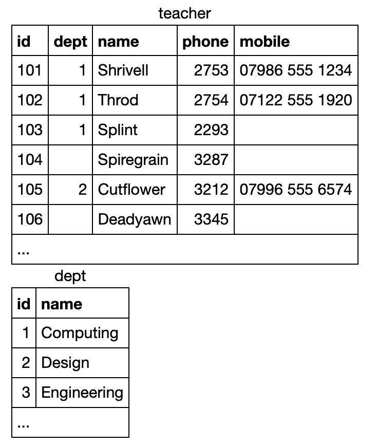
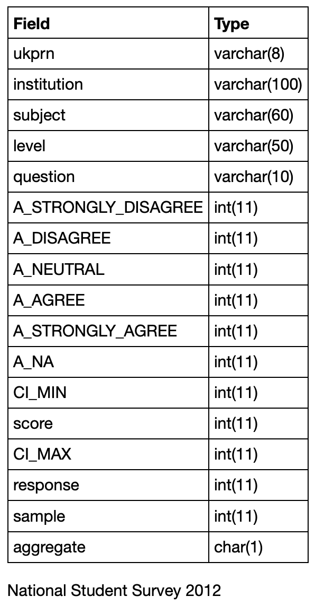
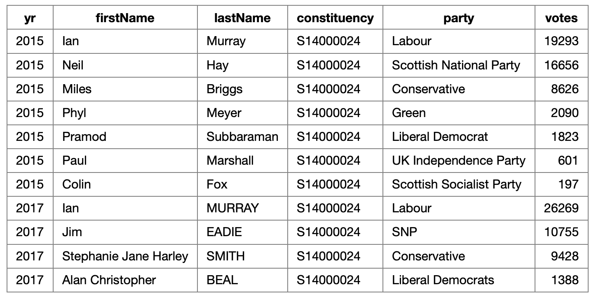

# 🐘 SQL Zoo Solutions

## 📘 What is this?

This a collection of my answers to the [SQL Zoo exercises](https://sqlzoo.net/wiki/SQL_Tutorial). 
Why did I make it? Well, it's a simple way for me to track what I have done and refer back to previous answers if I need to. 
All the exercises are laid out with their corresponding table, to help understanding.

## 🌍 Exercises with the 'world' table

- [Exercise 0: SQL basics](https://github.com/niamhireland/SQL_Zoo_Answers/blob/main/0%3A%20select_basics.sql)

- [Exercise 1: SELECT names](https://github.com/niamhireland/SQL_Zoo_Answers/blob/main/1%3A%20select_names.sql)

- [Exercise 2: SELECT from world](https://github.com/niamhireland/SQL_Zoo_Answers/blob/main/2.%20select_from_world.sql)

- [Exercise 4: SELECT within SELECT](https://github.com/niamhireland/SQL_Zoo_Answers/blob/main/4.%20select_within_select.sql)

- [Exercise 5: SUM and COUNT](https://github.com/niamhireland/SQL_Zoo_Answers/blob/main/5.%20sum_and_count.sql)

## 🏆 Exercises with the 'Nobel Prizes' table

- [Exercise 3: SELECT from Nobel Prize Winners](https://github.com/niamhireland/SQL_Zoo_Answers/blob/main/3.%20nobel.sql)

## ⚽ Exercises with the 'Soccer Games' table

- [Exercise 6: The JOIN operation](https://github.com/niamhireland/SQL_Zoo_Answers/blob/main/6.%20join_operation.sql)

## 🎭 Exercises with the 'Movies' table

- [Exercise 7: More JOIN operations](https://github.com/niamhireland/SQL_Zoo_Answers/blob/main/7.%20more_join_operations.sql)

## 👩‍🏫 Exercises with the 'Teachers' table 

- [Exercise 8: Using NULL](https://github.com/niamhireland/SQL_Zoo_Answers/blob/main/8.%20using_null.sql)

## 🧑‍🎓 Exercises with the 'National Student Survey' table 

- [Exercise 8+: Numeric examples](https://github.com/niamhireland/SQL_Zoo_Answers/blob/main/8%2B.%20numeric_examples.sql)

## 🗳️ Exercises with the 'Scottish General Election' table 

- [Exercise 9- : Window functions](https://github.com/niamhireland/SQL_Zoo_Answers/blob/main/9-.%20window_functions.sql)
